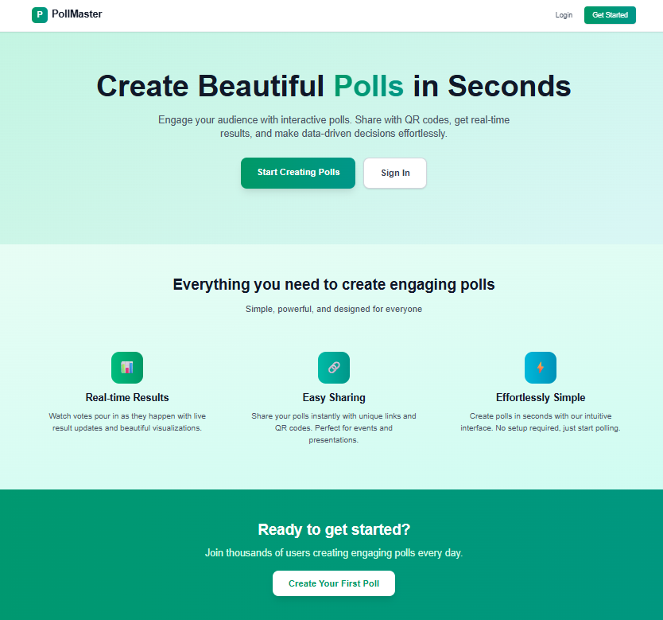
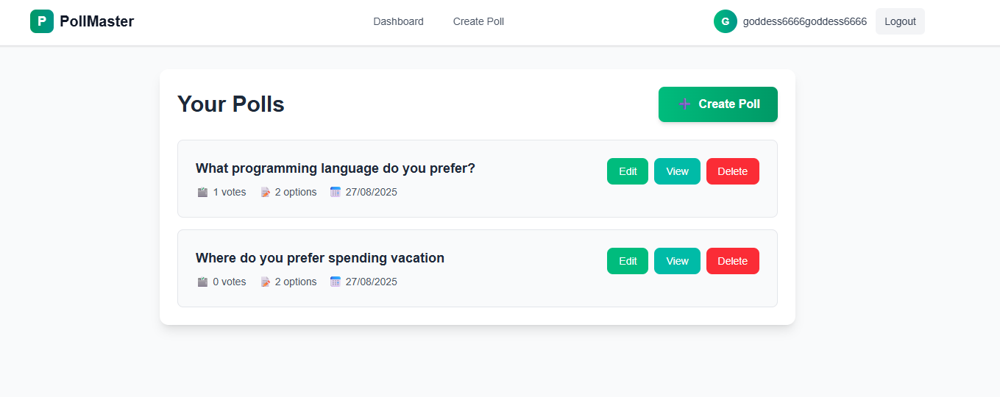
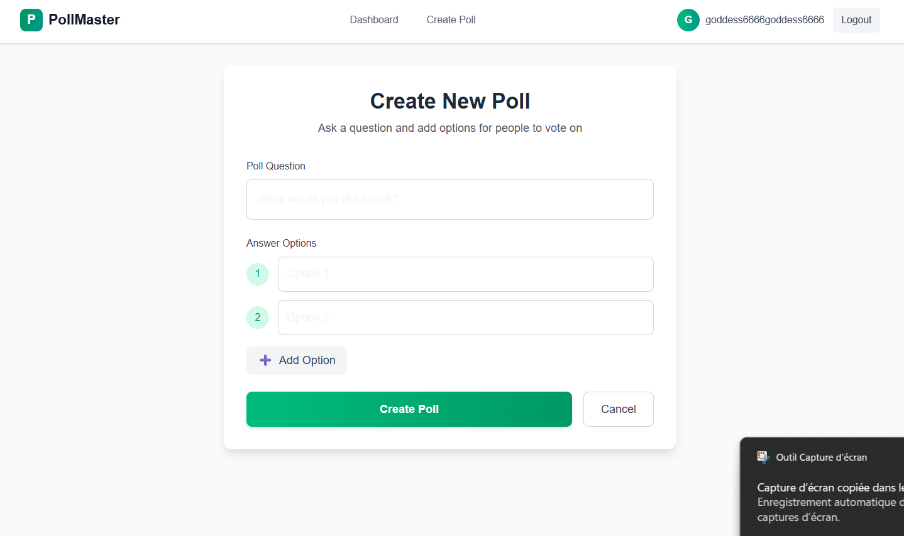
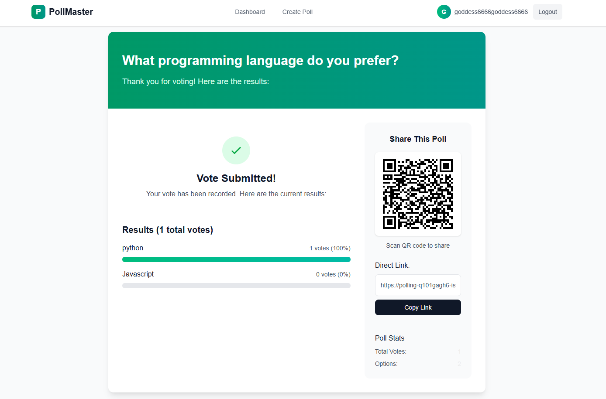

# 📊 PollMaster

A modern, full-stack polling application built with Next.js, Supabase, and deployed on Vercel. Create beautiful polls, share them with QR codes, and get real-time results instantly.

## ✨ Features

### 🔐 Authentication
- **User Registration/Login** - Secure authentication powered by Supabase Auth
- **Role-based Access** - Poll creators (registered users) and voters (registered/anonymous)

### 📋 Poll Management
- **Create Polls** - Add questions with multiple answer options
- **Edit/Delete Polls** - Full CRUD operations for poll creators
- **Dashboard** - Manage all your polls in one place

### 🔗 Sharing & Voting
- **Unique Shareable Links** - Every poll gets a unique URL for easy sharing
- **QR Code Generation** - Instant QR codes for quick mobile access
- **Duplicate Vote Prevention** - Smart system prevents multiple votes per user/IP
- **Real-time Results** - Live vote counts and percentage displays

### 📊 Analytics
- **Visual Results** - Beautiful progress bars and vote statistics
- **Vote Counts** - Track total votes and individual option performance
- **Responsive Design** - Works perfectly on desktop and mobile

## 🛠️ Tech Stack

### Frontend
- **Framework**: Next.js 15 with App Router
- **Language**: TypeScript for type safety
- **Styling**: Tailwind CSS for responsive design
- **UI Components**: Custom components with modern design patterns

### Backend & Database
- **Database**: Supabase PostgreSQL with real-time capabilities
- **Authentication**: Supabase Auth with email/password
- **API**: Next.js API routes with server-side rendering
- **Storage**: Supabase for user data and poll management

### Additional Libraries
- **QR Generation**: qrcode.react for shareable poll links
- **State Management**: React hooks and context
- **Form Handling**: Native React form management
- **Notifications**: Custom toast notifications

### Deployment & DevOps
- **Hosting**: Vercel with automatic deployments
- **Environment**: Environment variables for configuration
- **Performance**: Optimized builds and caching strategies

## 🚀 Getting Started

### Prerequisites
- **Node.js 18+** - [Download here](https://nodejs.org/)
- **npm or yarn** - Package manager (comes with Node.js)
- **Supabase Account** - [Sign up here](https://supabase.com/)
- **Vercel Account** - [Sign up here](https://vercel.com/) (for deployment)
- **Git** - For version control

### Installation

1. **Clone the repository**
   ```bash
   git clone https://github.com/ishtardev/polling-app.git
   cd polling-app
   ```

2. **Install dependencies**
   ```bash
   npm install
   ```

3. **Set up environment variables**
   Create a `.env.local` file in the root directory:
   ```env
   # Supabase Configuration
   NEXT_PUBLIC_SUPABASE_URL=your-supabase-project-url
   NEXT_PUBLIC_SUPABASE_ANON_KEY=your-supabase-anon-key
   
   # Optional: For development
   NODE_ENV=development
   ```
   
   **How to get Supabase credentials:**
   1. Go to your [Supabase Dashboard](https://app.supabase.com/)
   2. Select your project or create a new one
   3. Go to Settings → API
   4. Copy the "Project URL" and "anon public" key

4. **Set up Supabase database**
   
   **Step 1: Create the database schema**
   Go to your Supabase project → SQL Editor and run:
   ```sql
   -- Create polls table
   CREATE TABLE polls (
     id UUID DEFAULT gen_random_uuid() PRIMARY KEY,
     question TEXT NOT NULL,
     creator_id UUID REFERENCES auth.users(id),
     created_at TIMESTAMP DEFAULT NOW()
   );

   -- Create options table
   CREATE TABLE options (
     id UUID DEFAULT gen_random_uuid() PRIMARY KEY,
     poll_id UUID REFERENCES polls(id) ON DELETE CASCADE,
     text TEXT NOT NULL
   );

   -- Create votes table
   CREATE TABLE votes (
     id UUID DEFAULT gen_random_uuid() PRIMARY KEY,
     poll_id UUID REFERENCES polls(id) ON DELETE CASCADE,
     option_id UUID REFERENCES options(id) ON DELETE CASCADE,
     voter_id UUID REFERENCES auth.users(id),
     voter_ip TEXT,
     created_at TIMESTAMP DEFAULT NOW()
   );
   ```
   
   **Step 2: Set up Row Level Security (RLS)**
   ```sql
   -- Enable RLS on all tables
   ALTER TABLE polls ENABLE ROW LEVEL SECURITY;
   ALTER TABLE options ENABLE ROW LEVEL SECURITY;
   ALTER TABLE votes ENABLE ROW LEVEL SECURITY;
   
   -- Policies for polls table
   CREATE POLICY "Users can view all polls" ON polls FOR SELECT USING (true);
   CREATE POLICY "Users can create polls" ON polls FOR INSERT WITH CHECK (auth.uid() = creator_id);
   CREATE POLICY "Users can update own polls" ON polls FOR UPDATE USING (auth.uid() = creator_id);
   CREATE POLICY "Users can delete own polls" ON polls FOR DELETE USING (auth.uid() = creator_id);
   
   -- Policies for options table
   CREATE POLICY "Users can view all options" ON options FOR SELECT USING (true);
   CREATE POLICY "Users can manage options for own polls" ON options FOR ALL USING (
     EXISTS (SELECT 1 FROM polls WHERE polls.id = options.poll_id AND polls.creator_id = auth.uid())
   );
   
   -- Policies for votes table
   CREATE POLICY "Users can view all votes" ON votes FOR SELECT USING (true);
   CREATE POLICY "Users can create votes" ON votes FOR INSERT WITH CHECK (true);
   ```
   
   **Step 3: Configure Authentication**
   - Go to Authentication → Settings
   - Enable email confirmations if desired
   - Configure any additional auth providers

5. **Run the development server**
   ```bash
   npm run dev
   ```

6. **Open [http://localhost:3000](http://localhost:3000)** in your browser

## 🌐 Deployment

### Vercel Deployment (Recommended)

This app is optimized for Vercel deployment with automatic CI/CD:

1. **Initial Setup**
   ```bash
   # Install Vercel CLI
   npm i -g vercel
   
   # Login to Vercel
   vercel login
   
   # Connect your project
   vercel
   ```

2. **Configure Environment Variables**
   In your Vercel dashboard:
   - Go to Project Settings → Environment Variables
   - Add the following variables:
     ```
     NEXT_PUBLIC_SUPABASE_URL=your-supabase-project-url
     NEXT_PUBLIC_SUPABASE_ANON_KEY=your-supabase-anon-key
     NODE_ENV=production
     ```

3. **Deploy to Production**
   ```bash
   # Deploy to production
   vercel --prod
   
   # Or push to main branch for automatic deployment
   git push origin main
   ```

4. **Custom Domain (Optional)**
   - Go to Project Settings → Domains
   - Add your custom domain
   - Configure DNS settings as instructed

### Alternative Deployment Options

**Netlify**
```bash
# Build command
npm run build

# Publish directory
out

# Environment variables (same as Vercel)
NEXT_PUBLIC_SUPABASE_URL=your-url
NEXT_PUBLIC_SUPABASE_ANON_KEY=your-key
```

**Docker Deployment**
```dockerfile
# Create Dockerfile
FROM node:18-alpine
WORKDIR /app
COPY package*.json ./
RUN npm ci --only=production
COPY . .
RUN npm run build
EXPOSE 3000
CMD ["npm", "start"]
```

### Post-Deployment Checklist

- ✅ Test all authentication flows
- ✅ Verify poll creation and voting
- ✅ Check QR code generation
- ✅ Test mobile responsiveness
- ✅ Monitor Supabase connection
- ✅ Set up domain and SSL (if using custom domain)
- ✅ Configure analytics (optional)

## 📱 Usage Examples

### Creating Your First Poll

1. **Register an Account**
   - Visit the homepage and click "Register"
   - Enter your email and password
   - Verify your email if confirmation is enabled

2. **Create a New Poll**
   - Navigate to "Create Poll" from the dashboard
   - Enter your poll question (e.g., "What's your favorite programming language?")
   - Add multiple options (e.g., "JavaScript", "Python", "TypeScript", "Go")
   - Click "Create Poll" to generate your poll

3. **Share Your Poll**
   - Copy the unique poll URL from the success message
   - Share via social media, email, or messaging apps
   - Use the QR code for easy mobile sharing
   - Example poll URL: `https://yourapp.vercel.app/poll/abc123-def456`

### Voting Process

1. **Access a Poll**
   - Click on a shared poll link or scan QR code
   - No registration required for voting

2. **Cast Your Vote**
   - Select your preferred option
   - Click "Vote" to submit
   - View real-time results immediately

3. **View Results**
   - See vote counts and percentages
   - Visual progress bars for each option
   - Total vote count displayed

### Managing Your Polls

1. **Dashboard Overview**
   - View all your created polls
   - See vote counts and creation dates
   - Quick access to edit, view, or delete polls

2. **Edit Existing Polls**
   - Modify poll questions
   - Add or remove answer options
   - Changes reflect immediately for new voters

3. **Delete Polls**
   - Remove polls you no longer need
   - Confirmation prompt prevents accidental deletion
   - All associated votes are permanently removed

## 🧪 Testing the Application

### Local Development Testing

1. **Start the Development Server**
   ```bash
   npm run dev
   ```
   The app will be available at `http://localhost:3000`

2. **Test User Registration**
   - Create a test account with a valid email
   - Verify the registration flow works
   - Test login/logout functionality

3. **Test Poll Creation**
   - Create a poll with multiple options
   - Verify the poll appears in your dashboard
   - Test the auto-save draft feature

4. **Test Voting System**
   - Open the poll URL in an incognito window
   - Vote without being logged in
   - Try voting again to test duplicate prevention
   - Verify results update in real-time

5. **Test Poll Management**
   - Edit an existing poll
   - Delete a poll and confirm it's removed
   - Test the QR code generation

### Production Testing

1. **Deploy to Vercel**
   ```bash
   npx vercel --prod
   ```

2. **Test with Real Users**
   - Share poll links with friends or colleagues
   - Monitor vote counts and user behavior
   - Test on different devices and browsers

3. **Performance Testing**
   - Check page load speeds
   - Test with multiple concurrent voters
   - Monitor Supabase usage and limits

### Common Testing Scenarios

- **Anonymous Voting**: Test voting without user accounts
- **Mobile Responsiveness**: Test on various screen sizes
- **QR Code Functionality**: Scan codes with different devices
- **Data Persistence**: Verify votes and polls persist after page refresh
- **Error Handling**: Test with invalid inputs and network issues

## 📁 Project Structure

```
polling-app/
├── src/
│   ├── app/                    # Next.js App Router
│   │   ├── auth/               # Authentication pages
│   │   │   ├── login/          # Login page
│   │   │   └── register/       # Registration page
│   │   ├── create-poll/        # Poll creation page
│   │   ├── dashboard/          # User dashboard
│   │   ├── edit-poll/[id]/     # Poll editing page
│   │   ├── poll/[id]/          # Poll voting page
│   │   ├── globals.css         # Global styles
│   │   ├── layout.tsx          # Root layout
│   │   ├── Navbar.tsx          # Navigation component
│   │   └── page.tsx            # Homepage
│   ├── lib/
│   │   ├── supabase.ts         # Supabase client configuration
│   │   └── utils/
│   │       └── resultCalculator.ts  # Vote calculation utilities
│   └── types/
│       └── database.ts         # TypeScript type definitions
├── public/                     # Static assets
├── .env.local                  # Environment variables (create this)
├── .gitignore                  # Git ignore rules
├── next.config.js              # Next.js configuration
├── package.json                # Dependencies and scripts
├── tailwind.config.js          # Tailwind CSS configuration
└── tsconfig.json               # TypeScript configuration
```

## 🔧 Troubleshooting

### Common Issues and Solutions

**1. Supabase Connection Issues**
```bash
# Error: "Invalid API key" or connection failures
```
- Verify your `.env.local` file has correct Supabase credentials
- Check that your Supabase project is active
- Ensure the API key has proper permissions

**2. Database Schema Issues**
```bash
# Error: "relation does not exist" or "permission denied"
```
- Run the complete SQL schema from the setup instructions
- Verify Row Level Security policies are properly configured
- Check that all tables have the correct permissions

**3. Authentication Problems**
```bash
# Error: "User not authenticated" or login failures
```
- Verify Supabase Auth is enabled in your project
- Check email confirmation settings
- Ensure auth policies allow user registration

**4. Build/Deployment Issues**
```bash
# Error: Build failures or missing environment variables
```
- Verify all environment variables are set in production
- Check that your build command is `npm run build`
- Ensure Node.js version compatibility (18+)

**5. Vote Duplication Issues**
```bash
# Error: Users can vote multiple times
```
- Check that the vote prevention logic is working
- Verify IP address capture is functioning
- Review database constraints on the votes table

### Debug Mode

Enable debug logging by adding to your `.env.local`:
```env
NEXT_PUBLIC_DEBUG=true
```

### Getting Help

- Check the [GitHub Issues](https://github.com/ishtardev/polling-app/issues)
- Review [Supabase Documentation](https://supabase.com/docs)
- Consult [Next.js Documentation](https://nextjs.org/docs)
- Join the [Supabase Discord](https://discord.supabase.com/)

## 🎨 Screenshots

### Homepage
Modern landing page with feature highlights and call-to-action

### Dashboard
Clean interface to manage all your polls with statistics

### Creating polls 

### Poll Voting
Intuitive voting interface with instant results


## 🔐 Security Assessment

We conducted a thorough assessment of the authentication system and identified the following areas for improvement:

### Current Implementation
- **Supabase Authentication**: Uses Supabase's built-in authentication methods which provide basic security
- **Email/Password Auth**: Standard login and registration flows
- **Vote Protection**: Basic IP/user-based vote duplication prevention

### Security Recommendations
1. **Authentication Enhancements**:
   - Implement password strength requirements
   - Add rate limiting for login attempts
   - Consider adding multi-factor authentication for admin accounts

2. **Route Protection**:
   - Implement middleware for systematic route protection
   - Add session verification on protected routes
   - Create proper auth redirects for unauthenticated users

3. **Data Security**:
   - Ensure Supabase Row Level Security (RLS) policies are properly configured
   - Implement proper error handling that doesn't expose sensitive information
   - Add token refresh strategy for longer sessions

4. **General Improvements**:
   - Implement CSRF protection for form submissions
   - Add logging for security events (login attempts, password changes)
   - Create a session timeout for inactive users

These improvements would significantly enhance the security posture of the application while maintaining its usability.

## 🤝 Contributing

Contributions are welcome! Please feel free to submit a Pull Request.

## 🔗 Links

- **Live Demo**: [polling-app](https://polling-app-khaki-seven.vercel.app/)
- **Repository**: https://github.com/ishtardev/polling-app
- **Issues**: https://github.com/ishtardev/polling-app/issues

---

Built with ❤️ by [ishtardev](https://github.com/ishtardev)
