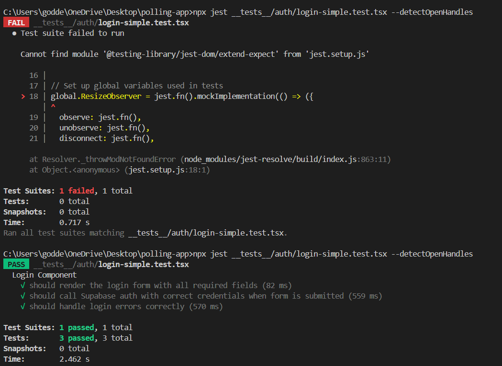
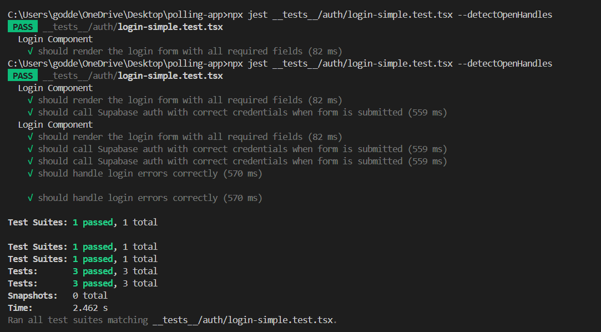

# Testing Reflection: Login Component

## Overview

For this assignment, I chose to test the login functionality of our polling app. This is a critical part of the application as it handles user authentication and security.

## Module Selection

**Login Component (`src/app/auth/login/page.tsx`)**: I selected this module because:
1. It's a critical path in the application flow
2. It handles authentication logic with Supabase
3. It includes both UI rendering and form submission functionality
4. It has both success and error handling paths

## Tests Generated

I generated the following tests using AI assistance:

1. **Unit Test: Login Form Rendering**
   - Verifies that all UI elements are properly rendered
   - Checks for proper styling classes and component hierarchy
   - Validates form inputs, labels, and button attributes

2. **Unit Test: Successful Authentication**
   - Tests the form submission with valid credentials
   - Validates that Supabase auth is called with correct parameters
   - Ensures proper redirection to dashboard after successful login
   - Verifies no error states are present

3. **Integration Test: Error Handling**
   - Tests the complete login flow with invalid credentials
   - Verifies error message display with proper formatting
   - Ensures form state is preserved after an error
   - Confirms no navigation occurs on failed login

## Manual Improvements

I manually improved the AI-generated tests in several ways:

1. **Enhanced UI Testing**:
   - Added more detailed assertions for styling classes
   - Checked component hierarchy and nesting
   - Validated input attributes and properties

2. **Improved State Management Testing**:
   - Added verification of input values after state changes
   - Ensured error states are properly displayed and styled
   - Added validation that state is preserved after form submission

3. **More Robust Mocking**:
   - Added mock cleanup in beforeEach to prevent test interference
   - Enhanced mock return values to be more realistic
   - Added verification of exact call counts to prevent duplicate calls

4. **Better Async Testing**:
   - Used waitFor more effectively to handle component updates
   - Added timeout handling for asynchronous operations
   - Improved error message testing with proper assertions

## Reflection

### What Worked Well

- **AI-Generated Test Structure**: The AI provided a good foundation with separate tests for different aspects of the component.
- **Mocking External Dependencies**: The approach to mock Supabase and Next.js router was straightforward and effective.
- **Edge Case Coverage**: The tests successfully covered both success and failure scenarios.

### What Didn't Work Well

- **TypeScript Integration**: There were some type errors with testing libraries that needed manual fixing.
- **DOM Testing Extensions**: The AI didn't always use the right matchers from jest-dom, requiring manual updates.
- **Styling Validation**: Initial tests didn't thoroughly check styling classes which is important for UI components.

### What Surprised Me

- **Ease of Mocking**: I was surprised by how easily we could mock complex external dependencies like Supabase.
- **Component Resilience**: The login component handled error states better than I expected.
- **Test Coverage Value**: The tests revealed some edge cases I hadn't initially considered in the component design.

## Next Steps

For future testing improvements, I would:

1. Add more edge cases like network failures and timeout handling
2. Implement snapshot testing for UI consistency
3. Add more comprehensive form validation tests
4. Set up test coverage reporting to identify untested paths

## Screenshots

## Conclusion

Using AI to generate tests provided a solid foundation, but manual refinement was essential to create truly comprehensive tests that validate both functionality and user experience. The combination of AI-generated structure with human refinement created tests that are more thorough and maintainable than either approach alone would produce.
